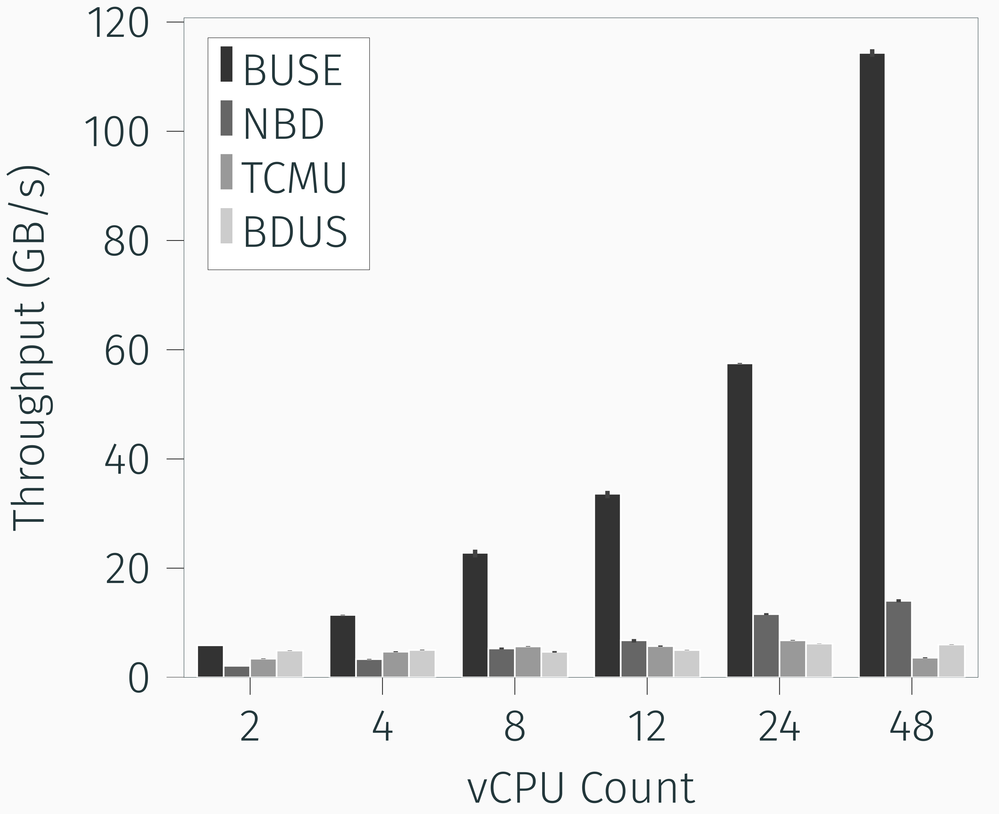

# BUSE: Block Device in Userspace

## Write performance comparison

<p align="center">  </p>

## Requirements

* GNU Make
* Linux Kernel 5.15 (or maybe newer)
* Linux Kernel Headers

## Installation

```
cd kernel
make
sudo make install
sudo modprobe buse
```
